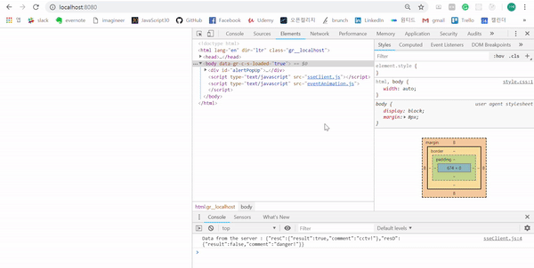

# Server Sent Event Test
Server sent event generates alert two type of animation depending on the information being transmitted. This is a front-end prototyping code to merge to 'ProjectSafeTown'.

## Getting Started
Check 'Ping's from server via console message and animations.

## Running the tests
step1. No installation. Fork this repository and pull it to your local enviroment. 
step2. Install npm packages : $npm install 
step3. Run streaming server : $node sseServer 
step4. Connect url 'localhost:8080' on internet browser(in my case, Chrome).
step5. Check 'Ping' consoles at ChromDevTools with alert animation.

### Break down into end to end tests
- Change the boolean value of 'sampleData' in sseServer.js 
- 'sampleData.resC.result = true/false' means check whether CCTV data are in DB 
- 'sampleData.resD.result = true/false' means check whether Danger spot data are in DB 

   
  CCTV alert animation and console message

 

   
  SSE Network

 

### Issue and code review
- sseClient.js: Only for SSE client request. Once request generates, doesn't stop check event from server even in no server connection.
- (sseServer.js) app.get('/event'): need to send Ping. Have to check whether it works asynchronized.
- (sseServer.js) setInterval: For infinite Ping test. Need non-send condition when there are no CCTV/Danger data via DataBase req/res.
- eventAnimations.js: Need to add condition which is 'do not insert data to dom if this event is not first' in 'draw functions'. Because every images and comment strings are the same in this prototyped code. But in real, need to renew to a new data like facebook new feed function.  

## Built With
- Front-end: No frameworks x No compilers x No libraries x No boilerplate. Vanilla JavaScript!
- Server: NPM(Express, path, compression:for SSE)

## Authors
Gi-baek lee, first commit, No contribution. [More about me, LinkedIn](https://www.linkedin.com/in/kibaeklee)

## Reference
- Server Sent Event architect: https://expressjs.com/en/resources/middleware/compression.html
- Alert animation: https://javascript.info/js-animation
- ssePseudoCode.js SSE architect(not implemented): https://www.npmjs.com/package/sse, https://www.w3schools.com/html/html5_serversentevents.asp

## License
- npm middleware: MIT
- Images: Pixabay.com
